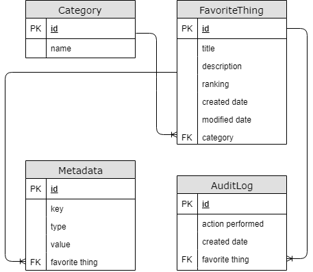

# Favorite Things

---
### Short description

Website to track your favorite things based on categories and rankings.

---

### Deployed project

https://favoritethings-britecore.herokuapp.com

---
### Deployment process

Since the project is hosted on Heroku, it is possible to sync the github repository and enable automatic deploys. Therefore every time that we push something to the master branch the project in summary will do the following:

- Install the dependencies (defined on the Pipfile and on package.json)
- Migrate all the new django migrations
- Build the project and run the server

---
### Technologies

Backend:
- **Server Side Scripting:** Python 3.6
- **Server framework:** Django
- **Database:** PostgreSQL
- **ORM:** Django
- **Deployment:** Heroku

Frontend:
- **Frameworks:** Vue.js and Vuetify

---
### Entity Relationship Diagram

---